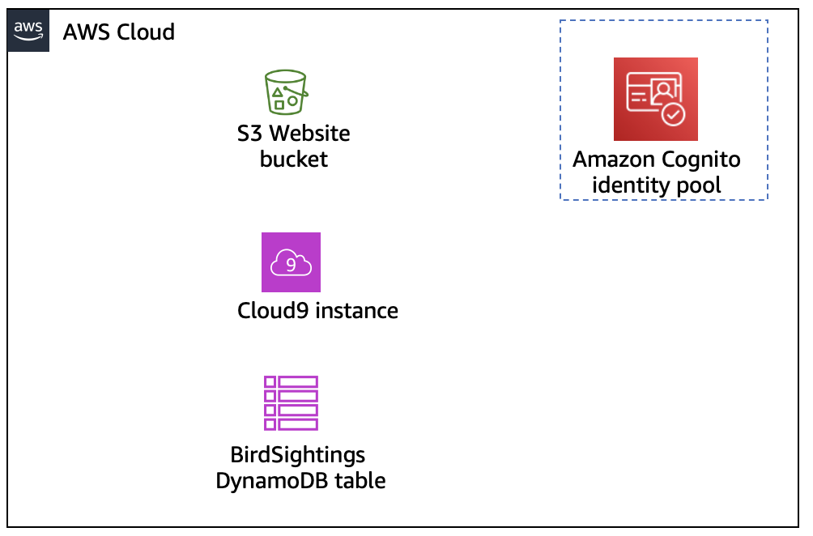
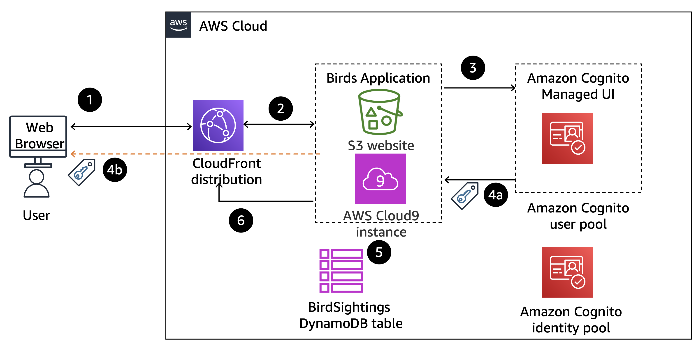

Lab Overview and Objectives
While building web applications, I often find that user authentication and authorization can be quite challenging. However, Amazon Cognito simplifies this process by providing a robust solution for adding sign-up, sign-in, and enhanced security functionality.

In this lab, I will configure an Amazon Cognito user pool, which I will use to manage users and their access to an existing web application. Additionally, I will create an Amazon Cognito identity pool to authorize users when the application makes calls to Amazon DynamoDB.

After completing this lab, I should be able to:

Create an Amazon Cognito user pool.
Add users to the user pool.
Update the example application to use the user pool for authentication.
Configure the Amazon Cognito identity pool.
Update the example application to use the identity pool for authorization.

Scenario
You have the Birds web application, which was built by using a NodeJs server running on an AWS Cloud9 instance and an Amazon Simple Storage Service (Amazon S3) bucket with static website hosting capability. The Birds application tracks students' bird sightings by using the following components:

A home page

An educational page that teaches students about birds

The following three protected pages, which students can access only if they have been authenticated:

A sightings page where students can view past bird sightings

A reporting page where students report new bird sightings

An administrator page where site administrators can perform additional operations

You need to add authentication and authorization to the application for the protected pages.

Starting architecture: You begin with the following architectural components. Initially, you use these components to install the application and get it running.

Architecture with starting resources.

Intermediate architecture: You add the following components to the architecture to implement authentication by using an Amazon Cognito user pool for protected pages.

 

Architecture showing the application integration with an Amazon Cognito user pool. More details in the lab text.

 

Step	Explanation
1	A user requests access to the protected page from the browser.
2	The request is routed to the NodeJs application server that is hosting the Birds application.
3	The application redirects the request to the Amazon Cognito managed UI.
4a	The user is authenticated by the Amazon Cognito user pool, and the access token is returned to the application.
4b	The Amazon Cognito SDK also stores the access token in browser's local storage for subsequent use, with the default expiration of 3,600 seconds.
5	The application validates the token and returns the protected page as requested.
6	The page is returned to the user's browser through the Amazon Cloudfront distribution.
Final architecture: Finally, you add additional authentication and authorization by using an Amazon Cognito identity pool to implement administrator access to the site.

 

[Image Description](images/Cognito-Final Architecture.png)

Architecture diagram of the web application once integrated with Amazon Cognito for authorization. 

 

Step	Explanation
1	The user requests access to the administrator page from the browser.
2	The request is routed to the NodeJs application server that is hosting the Birds application.
3	The application redirects the request to the Amazon Cognito managed UI.
4a	The user is authenticated by the Amazon Cognito user pool, and the access token is returned to the application.
4b	The Amazon Cognito SDK also stores the access token in browser's local storage for subsequent use, with the default expiration of 3,600 seconds.
5	The application validates the token and returns the administrator page as requested.
6	The page is returned to the user's browser through the Cloudfront distribution.
7	The user initiates a query to a DynamoDb table.
8	The application sends the token to the Amazon Cognito identity pool and receives temporary AWS credentials upon validation.
9	The application uses the received credentials to query the DynamoDB table and return data to the protected page. The page is returned to the user's browser through the Cloudfront distribution.
